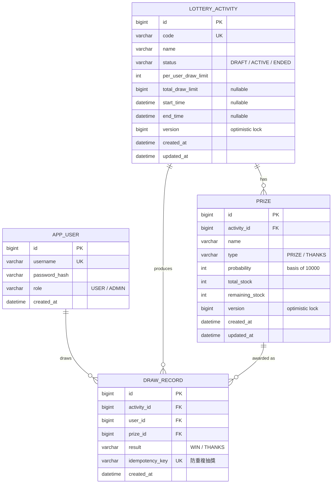

# 資料模型 (ER Diagram)

對應 Flyway `V1__init_schema.sql`。機率以整數萬分比（0–10000）儲存避免浮點誤差；`prize` 與 `lottery_activity` 帶 `version` 欄位做樂觀鎖。

## 關係說明

- 一個 **活動 (LOTTERY_ACTIVITY)** 底下有多個 **獎品 (PRIZE)**，其中一筆 `type = THANKS` 代表「銘謝惠顧」、不消耗庫存；同一活動所有獎品機率總和必須為 10000。
- 每次抽獎寫一筆 **DRAW_RECORD**，指向活動、使用者與實際中到的獎品。
- `draw_record.idempotency_key` 為唯一鍵：同一抽獎請求重送不會重複入帳（前面另有 Redis `SET NX` 擋，DB 唯一鍵是最後防線）。
- `draw_record.user_id` 邏輯上參照 `app_user.id`；未建 DB 外鍵是刻意的——抽獎是高頻寫入路徑，少一個外鍵檢查可降低鎖競爭，使用者存在性由應用層（JWT）保證。
